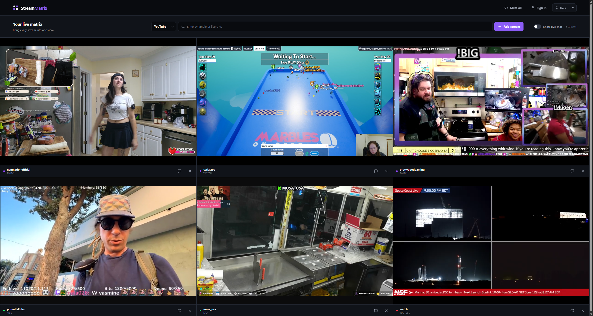

# StreamMatrix

StreamMatrix is a local web application for watching multiple Twitch, Kick, and YouTube live streams in one responsive dashboard.

## Features

- Add up to nine streams by Twitch/Kick username or YouTube handle/live URL.
- Automatically adapts the video grid to the number of active streams.
- Optional right-side chat with a selector for the active stream.
- Mute or unmute every active stream without reloading the players.
- Light, dark, and system color themes.
- Persists streams and preferences in local browser storage.
- Opens official platform login pages so supported embeds can use the same browser session.



### Mac Installation Note

If you see **"StreamMatrix is damaged and can't be opened"** when launching on Mac, this is due to Apple's Gatekeeper blocking unsigned apps. To fix it, open **Terminal** and run:

```
xattr -cr /Applications/StreamMatrix.app
```

Then try opening the app again. Alternatively go to **System Settings → Privacy & Security** and click **Open Anyway** if the option appears there.

## Provider Notes

- Twitch requires the embedding hostname as a `parent` parameter, so StreamMatrix must be served through the included local server rather than opened as a file.
- YouTube handles are resolved server-side to the channel's current public live video. A direct live video URL also works.
- Kick's official popout chat can be viewed in the app, but Kick does not currently support signing in or sending messages from that popout. Use the link beneath the chat to participate on Kick directly.
- Opening, closing, or switching chat only updates the chat panel. Existing video player elements remain mounted and continue playing.
